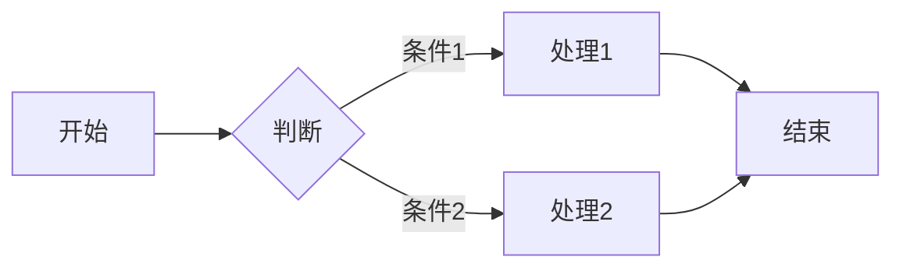
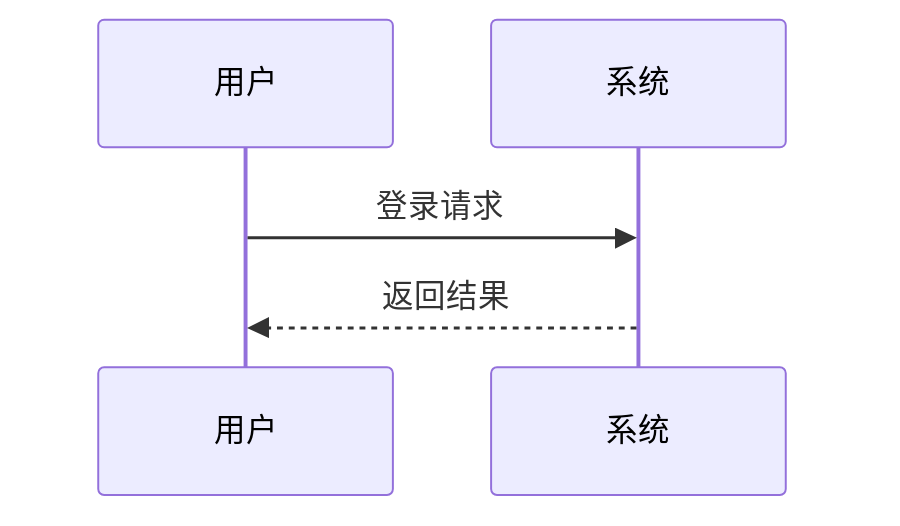
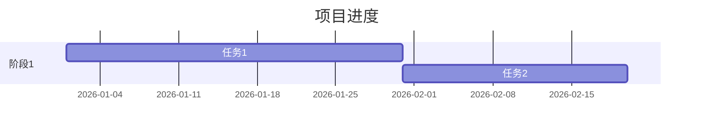
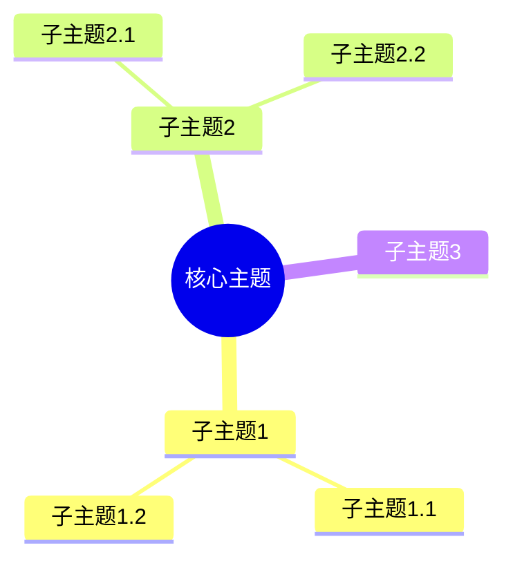
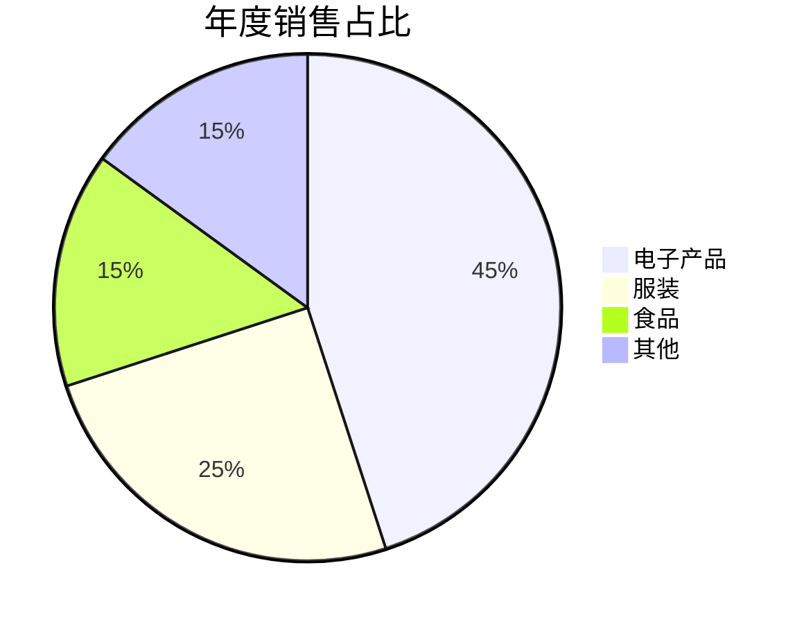
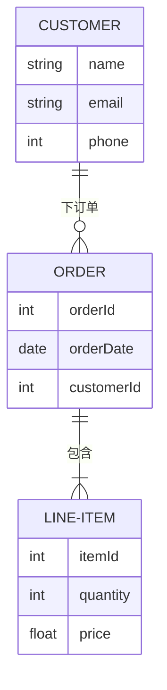
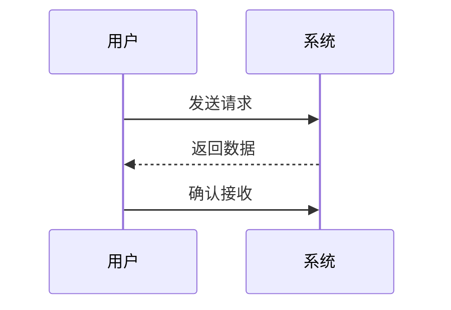
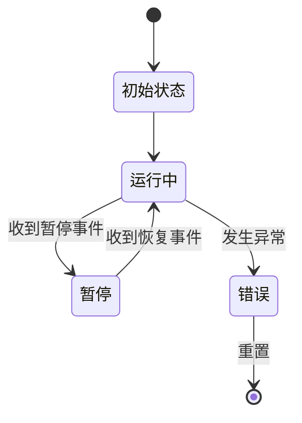

# Mermaid 图表组件示例

Mermaid 图表组件提供创建和显示 Mermaid 图表的功能，包括预览和查看代码两种模式。

## ✨ 特性

- 🖥️ **双视图模式**
  - 支持「预览」与「代码」两种模式自由切换。
- 🔍 **交互体验**
  - 支持缩放、重置视图和拖拽操作。
  - 节点具有悬停效果，增强交互性。
- 💾 **导出功能**
  - 一键下载思维导图的 SVG 文件或 Markdown 源码文件。
- 🧩 **嵌入式全屏**
  - 纯 CSS 实现，不依赖浏览器全屏 API。

## 🎈 组件参数说明

| 参数名    | 类型                  | 默认值    | 描述                       |
| --------- | --------------------- | --------- | -------------------------- |
| `content` | `string`              | `""`      | 输入的 Mermaid 内容         |
| `theme`   | `"light"` \| `"dark"` | `"light"` | 主题风格（未来可扩展样式） |
| `height`  | `string`              | `"600px"` | 组件高度                   |

## 📦 引入&使用

### 单个引入

在你要使用的页面中引入组件

```md
<script setup>
    import { defineClientComponent } from 'vitepress'
    import { Mermaid } from '@leelaa/vitepress-plugin-extended'
    const MermaidView = defineClientComponent(() => Mermaid)
</script>
```

### 全局引入

在你的`.vitepress/theme/index.ts`中引入组件

```js
import { defineAsyncComponent, h } from "vue";
import DefaultTheme from "vitepress/theme";
import { Mermaid } from "@leelaa/vitepress-plugin-extended";
export default {
  enhanceApp({ app }) {
    app.component("Mermaid", Mermaid);
  },
};
```

### 扩展 md 插件

在你的`.vitepress\config.ts`中引入插件

```js
import { defineConfig } from "vitepress";
import { MermaidPlugin } from "@leelaa/vitepress-plugin-extended";
export default defineConfig({
  markdown: {
    breaks: true,
    math: true,
    lineNumbers: true,
    lazyLoading: true,
    config: (md) => {
      MermaidPlugin(md);
    },
  },
});
```

## 使用

## 📁 示例

### vue组件的使用方式

```vue
<Mermaid content="graph LR
    A[开始] --> B{判断}
    B -->|条件1| C[处理1]
    B -->|条件2| D[处理2]
    C --> E[结束]
    D --> E" />
```

### md中的使用方式

```` md

````

### 流程图


### 时序图



### 甘特图



### 思维导图



### 饼图



### 实体关系图



### 时序图



### 状态图



## 🎈 组件参数说明

| 参数名    | 类型                  | 默认值    | 描述                       |
| --------- | --------------------- | --------- | -------------------------- |
| `content` | `string`              | `""`      | 输入的 Mermaid 内容        |
| `theme`   | `"light"` \| `"dark"` | `"light"` | 主题风格（未来可扩展样式） |
| `height`  | `string`              | `"600px"` | 组件高度                   |

## 📁 预览与下载

### 预览模式工具栏

| 按钮            | 功能                          |
| --------------- | ----------------------------- |
| 🔍 放大         | 点击后放大视图                |
| 🔎 缩小         | 点击后缩小视图                |
| 🔄 重置视图     | 点击后将视图重置为初始状态    |
| 💾 下载 SVG     | 点击后下载图表的 SVG 文件 |
| 🖥️ 切换全屏模式 | 点击后切换全屏显示图表    |

### 代码模式工具栏

| 按钮             | 功能                             |
| ---------------- | -------------------------------- |
| 📋 复制代码      | 点击后复制 Markdown 源码到剪贴板 |
| 💾 下载 Markdown | 点击后下载 Markdown 源码文件     |
| 🖥️ 切换全屏模式  | 点击后切换全屏显示 Markdown 源码 |
